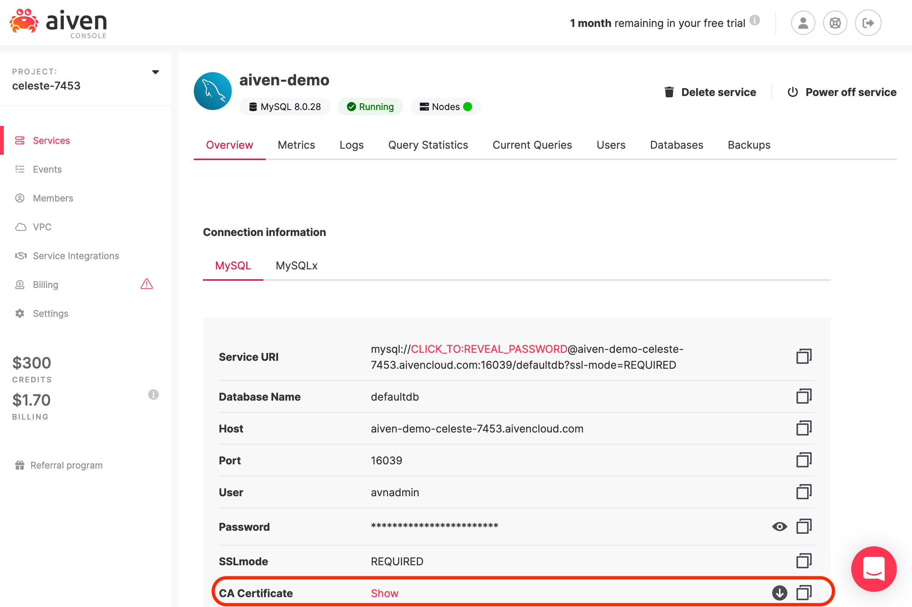
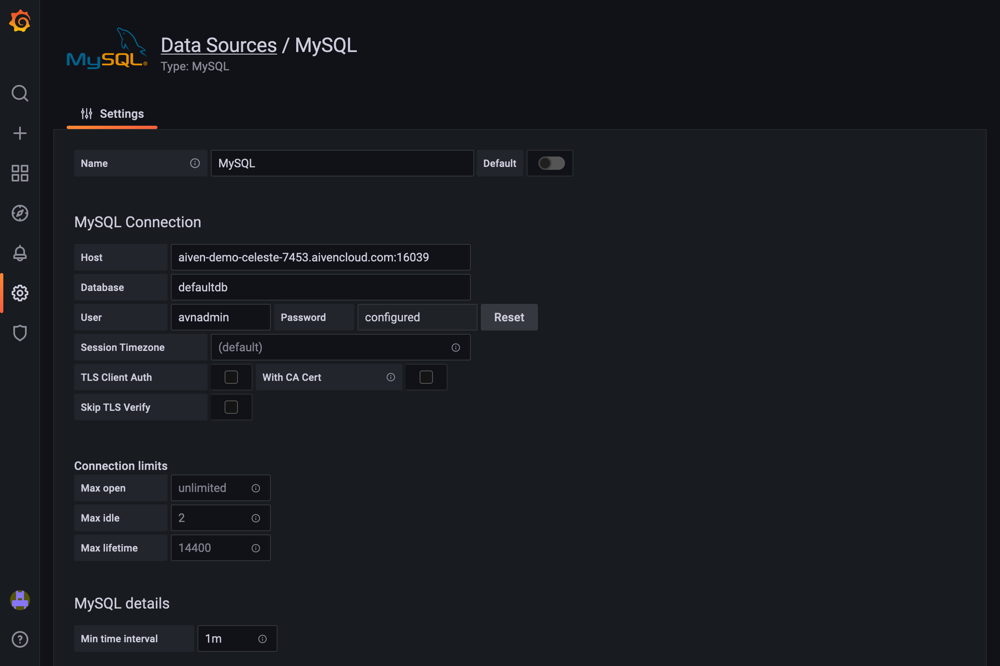
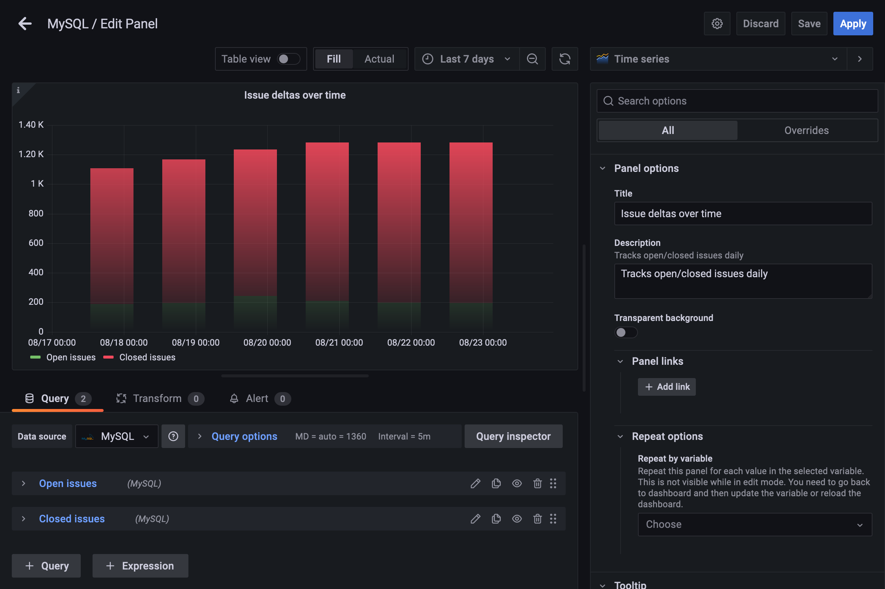

# Monitor your open source project’s health with Grafana for Aiven

One of the most useful metrics indicating an open source project’s success is issues: how many open issues versus closed issues over time. For example, a consistent number of open issues over time and an increasing number of closed issues might indicate that the maintainers are active. An increasing number of open issues and flat closed issues might indicate that a project is no longer maintained.

Project maintainers can use Grafana for Aiven to track these metrics as visualizations, and manage services without becoming experts in deploying things to the cloud. In essence, setting it and forgetting it.

Grafana has a [GitHub plugin](https://github.com/grafana/github-datasource), but most of the data it provides can’t be indexed over time. As such we need to build a small tool. 

We’ll use MySQL, the GitHub API, and Grafana to build a dashboard for the [Aiven devportal](https://github.com/aiven/devportal), monitoring opened and closed issues. We’ll create two Aiven services: Grafana and MySQL. Then we'll write a Python script to fetch data from the GitHub API. This project is a great next step if you’ve completed the [MySQL with Python quickstart](https://docs.aiven.io/docs/products/mysql/howto/connect-with-python.html).

You’ll need the following: 

- [An Aiven account](https://console.aiven.io/signup)
- A GitHub account
- A public repository

## Spin up MySQL and Grafana

In the [Aiven console](https://console.aiven.io/), click **Create a new service** with the configuration:

- **Service type:** MySQL
- **Cloud provider:** Digital Ocean (or your choice)
- **Service region:** Your choice 
- **Service plan:** Startup-1
- **Service name:** aiven-demo

Next, click **Create service**. It may take Aiven several minutes to spin up the service. When finished, Aiven shows you the service status screen:



Once spun up, download your CA certificate. We don't need it, but it's useful to have it on hand. Check that the service is running using any of the connection methods in [the docs](https://docs.aiven.io/docs/products/mysql/howto/connect-from-cli.html).

Next, spin up a Grafana service with the configuration:

- **Service type:** Grafana
- **Cloud provider:** Digital Ocean (or your choice)
- **Service region:** Your choice
- **Service plan:** Startup-1
- **Service name:** grafana-demo

When Aiven spins up Grafana, check that it’s working by visiting the service URI and using the login information provided. 



## Create a GitHub access token

We need an access token to use the GitHub API on the Aiven devportal repository. Create a GitHub [personal access token](https://github.com/settings/tokens) with the permissions:

- public_repo
- repo:status
- repo_deployment
- read:packages
- read:user

Copy your key somewhere safe - we'll need it later.

If you decide to access other data from the GitHub API in future, create a new token with appropriate permissions.

## Retrieving data from GitHub and storing it in MySQL

Next, let’s pull data from GitHub’s API, and store it in our MySQL database. To do that, we’ll use 2 Python packages:

- [PyMySql](https://pypi.org/project/PyMySQL/) to connect to the database
- [PyGitHub](https://pygithub.readthedocs.io/en/latest/) to use the GitHub REST API

Install both using `pip install`. 

Next, set up `main.py`:

```python
#!/usr/bin/env python3
#-*- coding: utf-8 -*-

import pymysql
from github import Github
from datetime import date
import datetime

## Parse our data
open_count = 0
closed_count = 0 
date = date.today()
formatted_date = date.strftime('%Y-%m-%d')

def parse():
	##TODO
    
## Write to the database 
def store(): 
	##TODO

## Execute 
def main():
    parse()
    store()

if __name__ == "__main__":
    main()
```
To track open and closed issues, we need a counter for each, and a variable well as today's date. MySQL’s date format expects `YYYY-MM-DD`, so use `strftime()` to format today's date. Set up two functions, `parse()` and `store()` to keep our code clean.

In `parse()`, use the GitHub access token we created as `YOUR_ACCESS_TOKEN`. If you're curious, read [PyGitHub’s documentation](https://pygithub.readthedocs.io/en/latest/) for more on how to configure access for other use cases. 

Next, access the API and increment counters for issues based on their state with simple loops. We’ll write these to the database in the next step. 

```python
def parse():
    g = Github("YOUR_ACCESS_TOKEN")
    repo = g.get_repo("aiven/devportal")
    global open_count
    global closed_count

    open_issues = repo.get_issues(state='open')
    for issue in open_issues:  
        open_count += 1

    closed_issues = repo.get_issues(state='closed')
    for issue in closed_issues:  
        closed_count += 1
```

Let’s build out our `store()` function to write to MySQL. Unlike the [MySQL Python quickstart](https://docs.aiven.io/docs/products/mysql/howto/connect-with-python.html), our `store()` function uses `connection.commit()` to commit (add) data to the database. Use the credentials in the Aiven console for MySQL to replace `YOUR_AIVEN_MYSQL_DB_NAME`, `YOUR_AIVEN_MYSQL_HOSTNAME`, `YOUR_AIVEN_MYSQL_PORT`, `YOUR_AVIEN_MYSQL_USERNAME`, and `YOUR_AIVEN_MYSQL_PASSWORD`.

Putting it together, we get:

```python
#!/usr/bin/env python3
#-*- coding: utf-8 -*-

import pymysql
from github import Github
from datetime import date
import datetime

## Parse our data
open_count = 0
closed_count = 0 
date = date.today()
formatted_date = date.strftime('%Y-%m-%d')

def parse():
    g = Github("YOUR_ACCESS_TOKEN")
    repo = g.get_repo("aiven/devportal")
    global open_count
    global closed_count

    open_issues = repo.get_issues(state='open')
    for issue in open_issues:  
        open_count += 1

    closed_issues = repo.get_issues(state='closed')
    for issue in closed_issues:  
        closed_count += 1
    
## Write to the database 
def store(): 
    global open_count 
    global closed_count 
    global formatted_date 
    timeout = 10
    connection = pymysql.connect(
        charset="utf8mb4",
        connect_timeout=timeout,
        cursorclass=pymysql.cursors.DictCursor,
        db="YOUR_AIVEN_MYSQL_DB_NAME",
        host="YOUR_AIVEN_MYSQL_HOSTNAME",
        port=YOUR_AIVEN_MYSQL_PORT,
        user="YOUR_AVIEN_MYSQL_USERNAME",
        password="YOUR_AIVEN_MYSQL_PASSWORD",
        read_timeout=timeout,
        write_timeout=timeout,
    )

    query = "INSERT INTO github (`date`, `open`, `closed`) VALUES ('" + formatted_date + "', '" + str(open_count) + "', '" + str(closed_count) + "')" 

    try:
        cursor = connection.cursor()
        cursor.execute("CREATE TABLE IF NOT EXISTS github (`date` DATE PRIMARY KEY, `open` INT, `closed` INT)")
        cursor.execute(query)
        cursor.execute("SELECT * FROM github")
        print(cursor.fetchall())
        connection.commit()

    finally:
        connection.close()

## Execute 
def main():
    parse()
    store()

if __name__ == "__main__":
    main()
```

The `store()` function builds a MyPySql `connection` object and an `INSERT` query from our global variables. Using a `cursor` object, it then creates a table, `github` and inserts the data. On subsequent calls of `main.py`, it only inserts data – this is what the `IF NOT EXISTS` keywords do.

In the `CREATE TABLE` statement, we set date as the primary key. Digital Ocean requires that all tables have a primary key, but it's good practice to do this anyways. Setting the date field as the primary key means we can only add data once a day, as all values in a primary key column must be unique. This isn't an issue for us, but keep it in mind when designing database tables for other applications.

Run `main.py` to create the table and generate data:

```bash 
$ python3 main.py
```

After running, you might want to add additional data for past dates so your graph has more to display when you launch it using a tool like MySQL Workbench. Be sure to add for **past dates only**, as you'll be recording from today onwards.

## Building out the Grafana dashboard

Next we need to display our data in Grafana.

1. Log into your Grafana instance’s dashboard at the service URI provided in the Aiven console
2.  Navigate to **Configuration > Data Sources**
3. Click **Add data source** and add MySQL as a data source, providing the credentials from the Aiven dashboard, and then save your changes


Grafana expects its service URIs to be in `host:port` format - the correct format in the example above is `aiven-demo-celeste-7453.aivencloud.com:16039`. 

Grafana also recommends configuring a specific user with read-only permissions for it. We haven’t done it in this here, but don’t go to production without doing so!

Next, navigate to **Create > Dashboard** and Click **Add a new panel** Use the following display options: 

- **Visualization (upper right)**: Time series
- **Graph style**: Bars
  - Line width: 0
  - Fill opacity: 100 
  - Gradient mode: opacity
  - Show points: never
  - Stack series: normal 
- **Standard options**
  - Unit: short
  - Color scheme: Green-Yellow-Red

In the query panel on the bottom, set your data source to **MySQL** and add two queries: one for open issues and one for closed issues:

```python
SELECT
  $__timeGroup(date, 24h) as time,
  open as "Open issues"
FROM
  githubtest
WHERE
  $__timeFilter(date, 24h)
ORDER BY 1
```

```python
SELECT
  $__timeGroup(date, 24h) as time,
  closed as "Closed issues"
FROM
  githubtest
WHERE
  $__timeFilter(date, 24h)
ORDER BY 1
```

Click **Apply**. Ensure that the view range for your visualization is something reasonable, like 7 days. Once the data loads you should see: 



## Cron it

For the data visualization to really shine, we need to run `main.py` once a day with a cron job.

In the Terminal, type `crontab -e`. Select an editor if required, and insert the following: 

```python
* */24 * * * /home/$(USER)/PATH_TO_YOUR_SCRIPT/main.py
```

## Next steps

The demo in this blog post could easily be modified to parse the other data, such as:

- Using the `comments` field on the GitHub issue object to identify particularly popular or active issues in the repository
- Tracking top issue openers or closers
- Identifying stale issues (ones open for a given length of time)
- Using other endpoints in GitHub's API to parse more data

Happy coding!